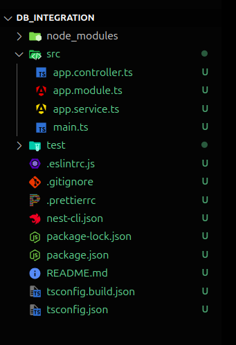

# Mastering Database Integration in NestJS: Combining SQL and NoSQL

In today's data-driven world, choosing the right database is crucial for application performance and scalability. SQL (Structured Query Language) and NoSQL (Not Only SQL) databases each have their advantages. This article explores how to integrate both using NestJS, a progressive Node.js framework.

# 1. Overview of SQL and NoSQL Databases

### SQL Databases:

**Structure:** Relational, with tables, rows, and columns.

**Query Language:** Uses SQL for complex queries and transactions.

**ACID Compliance:** Ensures reliable and consistent transactions.

**Examples:** PostgreSQL, MySQL, SQLite.

### NoSQL Databases:

**Structure:** Non-relational, storing data in various formats (key-value, documents, columns, graphs).

**Flexibility:** Schema-less design for dynamic data models.

**Scalability:** Designed for horizontal scalability.

**Examples:** MongoDB, Cassandra, Redis.

## Benefits of Using NestJS for Database Integration

### Unified Architecture:

**Consistent Design:** Modular architecture with decorators and dependency injection.

**Code Reusability:** Reusable modules and services for both SQL and NoSQL databases.

### Seamless Integration:

**Database Agnosticism:** Supports TypeORM, Mongoose, Sequelize, etc.

**Unified Querying:** Seamless querying with TypeORM (SQL) and Mongoose (NoSQL).

### Scalability and Performance:

**Microservices-Friendly:** Easy to scale individual parts independently.

**Efficient Data Handling:** Optimized for asynchronous programming and large datasets.

### Enhanced Developer Experience:

**TypeScript Support:** Strong typing and autocompletion for better productivity.

**Community and Documentation:** Extensive resources and support for database integration.

This article will guide you through setting up a NestJS application that integrates both SQL and NoSQL databases, demonstrating how to leverage the strengths of each in a single project.

### Let's start building our project

# 2. Create a New NestJS Project:

- **Global Installation (Optional):** If you plan to create multiple NestJS projects in the future, you can install the Nest CLI globally:

  ```bash
  npm install -g @nestjs/cli
  ```

- **Project Creation:** Navigate to your desired project directory and run the following command to create a new NestJS project:

  ```bash
  nest new <project_name>
  ```

  Replace **_<project_name>_** with your preferred project name.

### Install Packages:

- **Sequelize ORM for SQL Database (e.g., PostgreSQL):**

  ```bash
  cd <project_name>
  npm install --save @nestjs/sequelize sequelize sequelize-typescript pg pg-hstore
  npm install --save-dev @types/sequelize
  ```

- **Native Driver for NoSQL Database (e.g., MongoDB):**

  ```
  npm install mongoose @nestjs/mongoose
  ```

### Project Structure:

NestJS will create a basic project structure for you. The important directory for database interactions is src. This is where you'll define your entities (for SQL) or models (for NoSQL) and services to interact with the database.



# 3. Configuring SQL Database

- **Install PostgreSQL:** Download and install PostgreSQL from the official website. if you have not installed yet.

- **Create a Database:** Use the psql command to create a new database (replace <your_database_name> with your desired name):

  ```sql
  CREATE DATABASE nestjs_db;
  ```

- **Connect to PostgreSQL in NestJS:**

  In **_app.module.ts_**, configure Sequelize to connect to your database:

  ```typescript
  SequelizeModule.forRoot({
    dialect: 'postgres',
    host: process.env.DB_HOST, // Load from .env file
    port: Number(process.env.DB_PORT),
    username: process.env.DB_USERNAME,
    password: process.env.DB_PASSWORD,
    database: process.env.DB_NAME,
    autoLoadModels: true, // Automatically load models
    synchronize: true, // Sync models with database (for development only)
  });
  ```

  Create a **_.env_** file to store your database credentials securely:

  ```properties
  DB_HOST=localhost
  DB_PORT=5432
  DB_USERNAME=yourusername
  DB_PASSWORD=yourpassword
  DB_NAME=nestjs_db
  ```

## Create User module to handle services and models

Generate a module using nest cli

```bash
nest g mo user // this will generate a module with user.module.ts file.
```

Not generate controller and services file to handle route and db logic

```bash
nest g co user --no-spec // this will generate a user.controller.ts
nest g s user --no-spec // this will generate a user.service.ts
```

- **Creating Entities, Repositories, and Services for SQL:**

  Create a file name user.entity.ts to create an entity for user inside user module and replce it's code with following.

  ```typescript
  // src/user/user.entity.ts

  import {
    Table,
    Column,
    Model,
    DataType,
    PrimaryKey,
  } from 'sequelize-typescript';
  @Table({
    tableName: 'users',
    timestamps: true,
  })
  export class User extends Model {
    @PrimaryKey
    @Column({
      autoIncrement: true,
      unique: true,
      type: DataType.INTEGER,
    })
    id: number;
    @Column({
      type: DataType.STRING,
      allowNull: false,
    })
    name: string;
    @Column({
      type: DataType.STRING,
      allowNull: false,
    })
    email: string;
  }
  ```

HELLL
